# 🏰 The Ultimate DSA Mastery Roadmap (C# Edition)

[]() []() []()

> **Goal:** Move beyond code memorization to deep algorithmic intuition.  
> **Philosophy:** Understand the *Pattern*, Visualize the *Movement*, Master the *Trade-offs*.

---


## 🚀 DSA MASTERY: THE 13-WEEK JOURNEY

```text
PHASE 1: FOUNDATIONS (Understand the Machine)
│
├── WEEK 1: COMPUTATIONAL MODEL
│   ├── Day 1: RAM Model & Pointers (How memory works)
│   ├── Day 2: Asymptotic Analysis (Big-O derivation)
│   ├── Day 3: Space Complexity (Stack vs Heap)
│   ├── Day 4: Recursion I (Stack frames, base cases)
│   └── Day 5: Recursion II (Tail recursion, mutual recursion)
│
├── WEEK 2: LINEAR STRUCTURES
│   ├── Day 1: Arrays (Cache locality, contiguous memory)
│   ├── Day 2: Dynamic Arrays (Amortized analysis)
│   ├── Day 3: Linked Lists (Pointer structures)
│   ├── Day 4: Stacks & Queues (LIFO/FIFO ADTs)
│   └── Day 5: Binary Search (Logarithmic reduction)
│
└── WEEK 3: SORTING & HASHING
    ├── Day 1: Elementary Sorts (Bubble, Insertion, Selection)
    ├── Day 2: Merge Sort & Quick Sort (Divide & Conquer)
    ├── Day 3: Heap Sort & Variants (In-place sorting)
    ├── Day 4: Hash Tables I (Hash functions, collisions)
    └── Day 5: Hash Tables II (Chaining vs Open Addressing)

PHASE 2: PATTERNS & HIERARCHIES
│
├── WEEK 4: PROBLEM-SOLVING PATTERNS
│   ├── Day 1: Two Pointers (Strategy & invariants)
│   ├── Day 2: Sliding Window - Fixed (Subarray analysis)
│   ├── Day 3: Sliding Window - Variable (Optimization)
│   ├── Day 4: Prefix Sums (Range query optimization)
│   └── Day 5: Cycle Detection (Floyd's Algorithm)
│
├── ⭐ WEEK 4.5: TIER 1 - CRITICAL PATTERNS (High ROI)
│   ├── Day 1: Hash Map / Hash Set (70% of interviews)
│   ├── Day 2: Monotonic Stack (Next Greater Element)
│   ├── Day 3: Merge Operations (Sorted structures)
│   ├── Day 4a: Partitioning (Dutch National Flag)
│   └── Day 4b: Kadane's Algorithm (Max Subarray)
│
├── WEEK 5: TREES & HEAPS
│   ├── Day 1: Binary Tree Anatomy (Properties)
│   ├── Day 2: Tree Traversals (In/Pre/Post/Level)
│   ├── Day 3: Binary Search Trees (BST invariants)
│   ├── Day 4: Heaps & Priority Queues (Complete trees)
│   └── Day 5: Balanced Trees (AVL/Red-Black concepts)
│
└── ⭐ WEEK 5.5: TIER 2 - STRATEGIC PATTERNS
    ├── Day 1: Difference Array (Range updates)
    ├── Day 2: In-Place Replacement (Space optimization)
    └── Day 3: Deque Operations (Sliding window max)

PHASE 3: GRAPHS & NETWORKS
│
├── WEEK 6: GRAPH FOUNDATIONS
│   ├── Day 1: Graph Representations (Adj Matrix vs List)
│   ├── Day 2: Breadth-First Search (Shortest path unweighted)
│   ├── Day 3: Depth-First Search (Recursive exploration)
│   ├── Day 4: Topological Sort (Dependency resolution)
│   └── Day 5: Union-Find (Disjoint Set Forest)
│
└── WEEK 7: ADVANCED GRAPHS
    ├── Day 1: Dijkstra's Algorithm (Weighted shortest path)
    ├── Day 2: Bellman-Ford & Floyd-Warshall (Negative weights)
    ├── Day 3: Minimum Spanning Trees (Kruskal & Prim)
    ├── Day 4: Network Flow I (Max Flow / Ford-Fulkerson)
    └── Day 5: Network Flow II (Min Cut / Bipartite Matching)

PHASE 4: ADVANCED TOPICS
│
├── WEEK 8: SPECIALIZED STRUCTURES
│   ├── Day 1: Tries (Prefix Trees)
│   ├── Day 2: Segment Trees I (Range Queries)
│   ├── Day 3: Segment Trees II (Lazy Propagation)
│   ├── Day 4: Fenwick Trees (Binary Indexed Trees)
│   └── Day 5: Suffix Structures (Arrays & Trees)
│
└── WEEK 9: STRING & MATH
    ├── Day 1: KMP Algorithm (Pattern matching)
    ├── Day 2: Rabin-Karp (Rolling Hash)
    ├── Day 3: Number Theory (Primes, GCD)
    ├── Day 4: Modular Arithmetic (Exponentials)
    └── Day 5: Computational Geometry (Convex Hull)

PHASE 5: ALGORITHMS & MASTERY
│
├── WEEK 10: GREEDY & BACKTRACKING
│   ├── Day 1: Greedy Paradigm (Exchange arguments)
│   ├── Day 2: Backtracking I (Constraint satisfaction)
│   ├── Day 3: Backtracking II (Advanced pruning)
│   ├── Day 4: Pruning & Optimization (Search space reduction)
│   └── Day 5: Divide and Conquer (Paradigm analysis)
│
├── WEEK 11: DYNAMIC PROGRAMMING
│   ├── Day 1: DP Philosophy (Memoization vs Tabulation)
│   ├── Day 2: 1D DP (Linear recurrence)
│   ├── Day 3: Classic Patterns (LCS, Knapsack)
│   ├── Day 4: 2D / Sequence DP (Grid problems)
│   └── Day 5: Advanced DP (Bitmask / Tree DP)
│
├── WEEK 12: INTERVIEW MASTERY (Capstone)
│   ├── Day 1: Merge Intervals (Sweep line)
│   ├── Day 2: Monotonic Stack Advanced (Rectangles)
│   ├── Day 3: Cyclic Sort (In-place rearrangement)
│   ├── Day 4: Matrix Problems (Traversal patterns)
│   └── Day 5: System Review & Integration
│
└── ⭐ WEEK 13+: TIER 3 - EXTENSION PATTERNS
    ├── Pattern 1: Fast & Slow Pointers (Extended)
    ├── Pattern 2: Reverse & Two Pointers
    ├── Pattern 3: Matrix Traversal
    └── Pattern 4: Conversion & Encoding
```

---

## 🗺️ Visual Overview

### visual summary
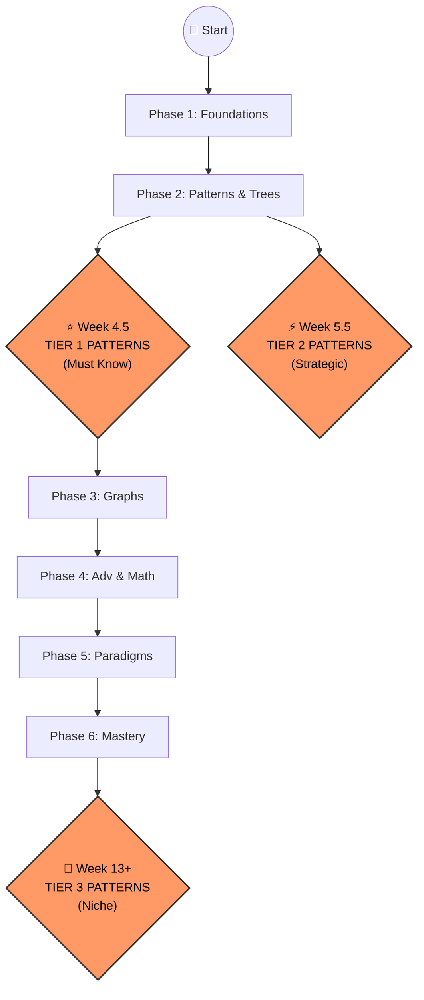

### Phase 1 

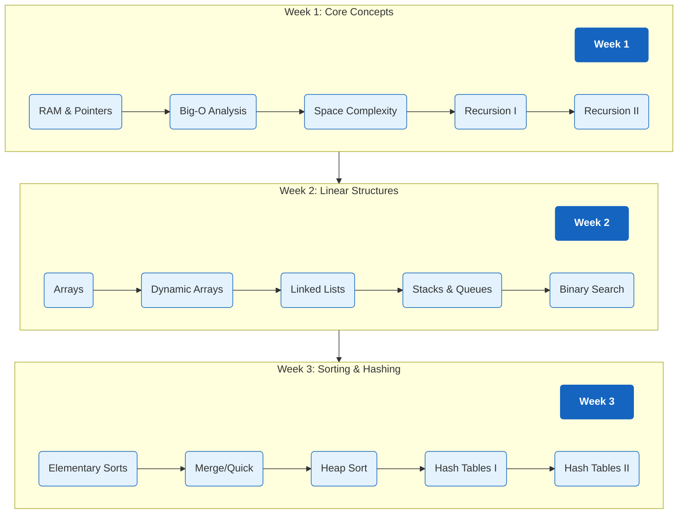

### Phase 2

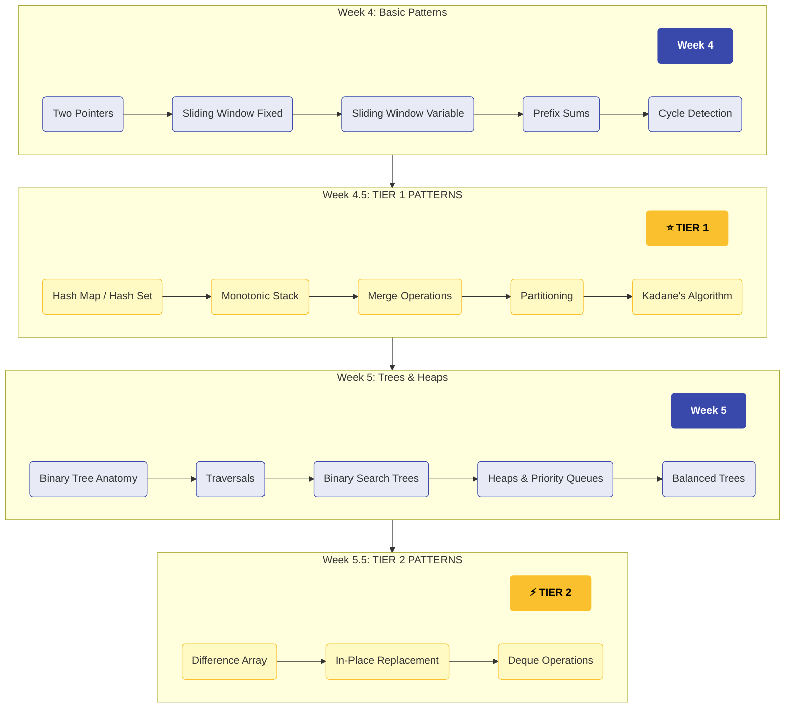

### Phase 3

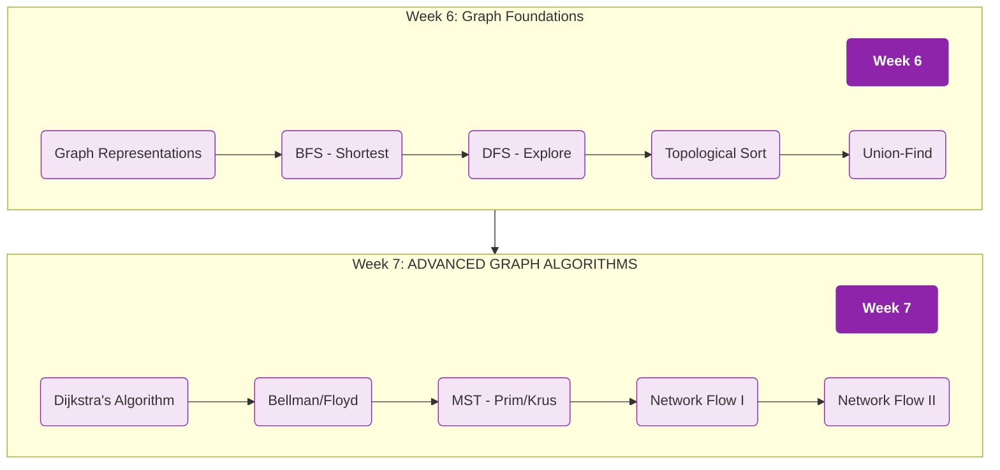

### Phase 4 

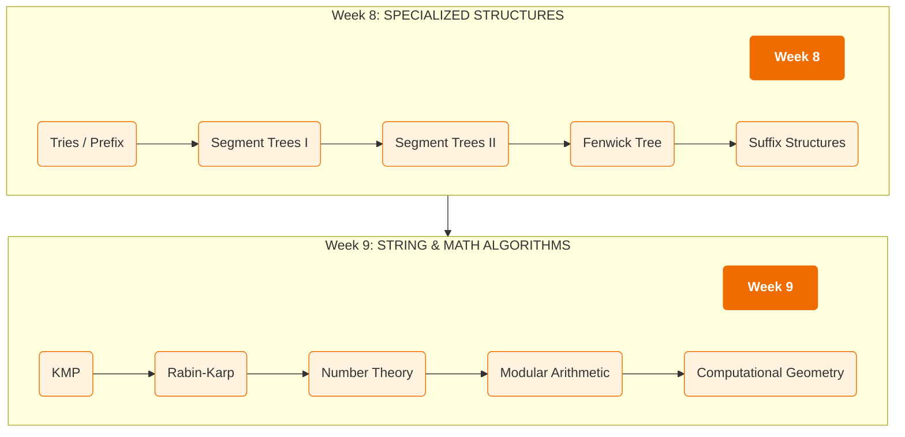

### Phase 5 

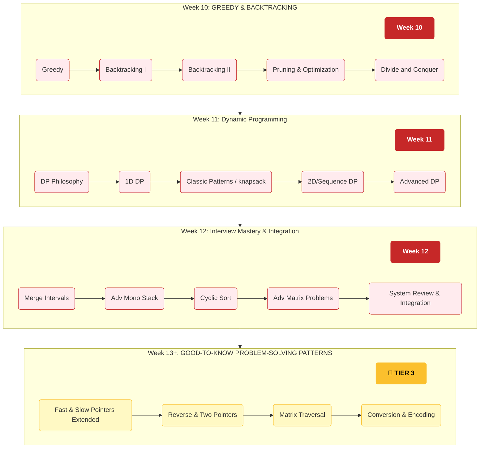

<!-- 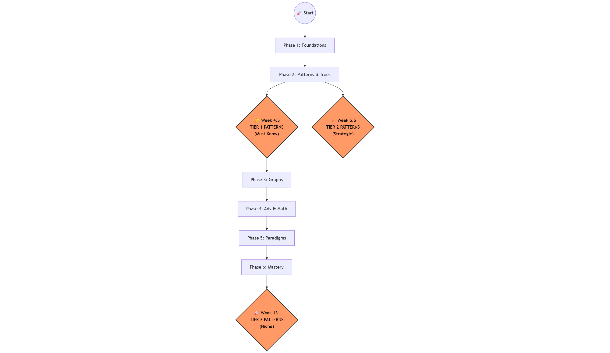

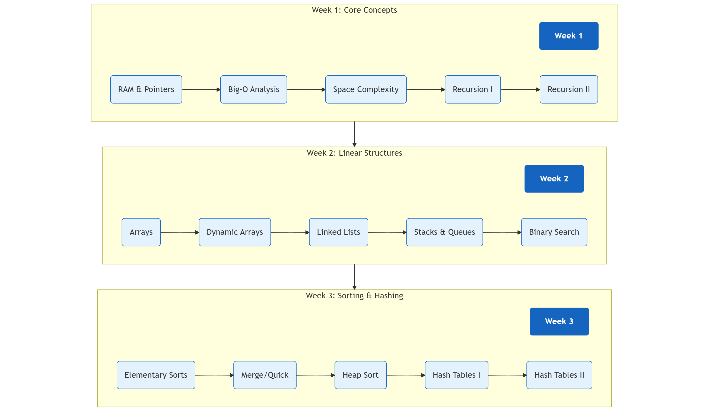

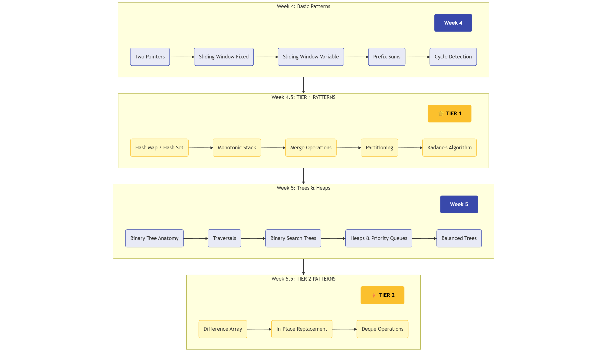

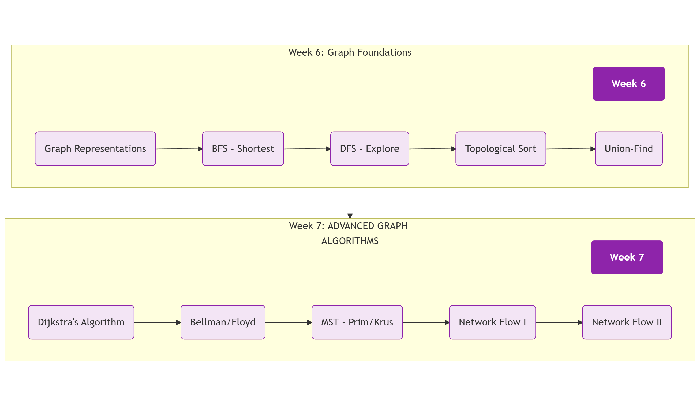

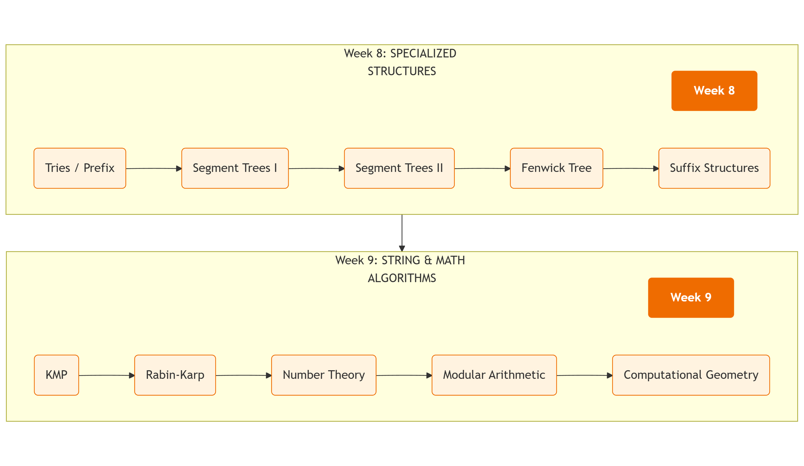

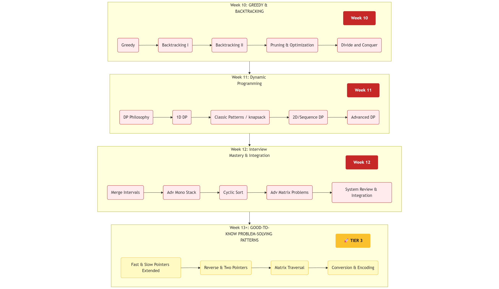 -->

---

## 🚦 Progress Tracker

**Current Status:** `Week 0`

**Patterns Mastered:** `0 / 40`

`[░░░░░░░░░░░░░░░░░░░░] 0% Complete`

---

## 📚 The Curriculum

### 🟢 Phase 1: The Bedrock (Weeks 1-3)

*Focus: RAM Model, Big-O, and Linear Data Structures.*

<details>
<summary><strong>Week 1: Foundations & Complexity</strong></summary>

| Day | Topic | Focus | Status |
| --- | --- | --- | --- |
| **Mon** | 🧠 RAM Model & Pointers | Stack vs Heap, References in C# | [ ] |
| **Tue** | 📉 Asymptotic Analysis | Big-O, Omega, Theta | [ ] |
| **Wed** | 📦 Space Complexity | Stack Frames, Aux Space | [ ] |
| **Thu** | 🔄 Recursion I | Base cases, Visualization | [ ] |
| **Fri** | 🔄 Recursion II | Tail recursion, Tree recursion | [ ] |

</details>

<details>
<summary><strong>Week 2: Linear Structures</strong></summary>

| Day | Topic | Focus | Status |
| --- | --- | --- | --- |
| **Mon** | 🚃 Arrays & Strings | Cache locality, `Span<T>` | [ ] |
| **Tue** | 🧱 Dynamic Arrays | `List<T>` resizing logic | [ ] |
| **Wed** | 🔗 Linked Lists | Generic `LinkedList<T>` | [ ] |
| **Thu** | 🥞 Stacks & Queues | LIFO/FIFO, Monotonic conceptual | [ ] |
| **Fri** | 🔍 Binary Search | `O(log n)` reduction | [ ] |

</details>

<details>
<summary><strong>Week 3: Sorting & Hashing</strong></summary>

| Day | Topic | Focus | Status |
| --- | --- | --- | --- |
| **Mon** | 🧼 Elementary Sorts | Bubble/Insertion (Why they are slow) | [ ] |
| **Tue** | ⚡ Merge & Quick Sort | Divide & Conquer mechanics | [ ] |
| **Wed** | 🔑 Hash Tables I | Collision Theory, Load Factor | [ ] |
| **Thu** | 🗝️ Hash Tables II | `Dictionary<K,V>` internals | [ ] |
| **Fri** | 🧩 Review & Integration | Combining Sort + Hash | [ ] |

</details>

---

### 🔵 Phase 2: Patterns & Hierarchies (Weeks 4-5.5)

*Focus: The "Big 5" Patterns and Tree structures.*

<details>
<summary><strong>Week 4: Essential Patterns</strong></summary>

| Day | Topic | ROI | Status |
| --- | --- | --- | --- |
| **Mon** | 👉 Two Pointers | ⭐⭐⭐⭐⭐ | [ ] |
| **Tue** | 🪟 Sliding Window (Fixed) | ⭐⭐⭐⭐⭐ | [ ] |
| **Wed** | 🐛 Sliding Window (Var) | ⭐⭐⭐⭐⭐ | [ ] |
| **Thu** | 🔢 Prefix Sums | ⭐⭐⭐ | [ ] |
| **Fri** | 🐢 Fast & Slow Pointers | ⭐⭐⭐ | [ ] |

</details>

<details open>
<summary><strong>🔥 Week 4.5: TIER 1 - CRITICAL PATTERNS</strong></summary>
<em>These patterns solve 70% of interview questions. Do not skip.</em>

| Pattern | Usage Frequency | Key Use Case | Status |
| --- | --- | --- | --- |
| **Hash Map Pattern** | 70% | Two Sum, Frequency Counts | [ ] |
| **Monotonic Stack** | 30% | Next Greater Element | [ ] |
| **Merge Operations** | 30% | Merging sorted lists | [ ] |
| **Partitioning** | 15% | Move Zeroes, QuickSelect | [ ] |
| **Kadane's Algo** | 10% | Max Subarray Sum | [ ] |

</details>

<details>
<summary><strong>Week 5: Trees & Heaps</strong></summary>

| Day | Topic | Focus | Status |
| --- | --- | --- | --- |
| **Mon** | 🌳 Binary Tree Anatomy | Node structure, Depth vs Height | [ ] |
| **Tue** | 🚶 Tree Traversals | In/Pre/Post/Level Order | [ ] |
| **Wed** | 🔍 BST Operations | Search, Insert, Delete | [ ] |
| **Thu** | 🗻 Heaps (PriorityQueue) | Min-Heap properties | [ ] |
| **Fri** | ⚖️ Balanced Trees | AVL/Red-Black concepts | [ ] |

</details>

<details>
<summary><strong>⚡ Week 5.5: TIER 2 - STRATEGIC PATTERNS</strong></summary>

| Pattern | Usage Frequency | Key Use Case | Status |
| --- | --- | --- | --- |
| **Difference Array** | 15% | Range Updates (Booking) | [ ] |
| **In-Place Ops** | 12% | Array Manipulation | [ ] |
| **Deque Window** | 10% | Sliding Window Max | [ ] |

</details>

---

### 🟣 Phase 3: Connectivity (Weeks 6-7)

*Focus: Graphs, Networking, and Relationships.*

<details>
<summary><strong>Week 6: Graph Foundations</strong></summary>

| Day | Topic | Focus | Status |
| --- | --- | --- | --- |
| **Mon** | 🕸️ Graph Reps | Adjacency List vs Matrix | [ ] |
| **Tue** | 🌊 BFS (Shortest Path) | Queue-based traversal | [ ] |
| **Wed** | 🕵️ DFS (Exploration) | Stack/Recursion traversal | [ ] |
| **Thu** | 🏗️ Topological Sort | Dependency Resolution | [ ] |
| **Fri** | 🤝 Union-Find (DSU) | Connected Components | [ ] |

</details>

<details>
<summary><strong>Week 7: Advanced Graphs</strong></summary>

| Day | Topic | Focus | Status |
| --- | --- | --- | --- |
| **Mon** | ⚡ Dijkstra's Algo | Weighted Shortest Path | [ ] |
| **Tue** | 🔄 Bellman-Ford | Negative Weights | [ ] |
| **Wed** | 🌲 MST (Prim/Kruskal) | Network Design | [ ] |
| **Thu** | 🌊 Network Flow I | Max Flow Min Cut | [ ] |
| **Fri** | 🚢 Network Flow II | Bipartite Matching | [ ] |

</details>

---

### 🟠 Phase 4: Advanced & Math (Weeks 8-9)

*Focus: Indexing, Strings, and Number Theory.*

<details>
<summary><strong>Week 8: Specialized Indexing</strong></summary>

| Day | Topic | Status |
| --- | --- | --- |
| **Mon** | 🌲 Tries (Prefix Tree) | [ ] |
| **Tue** | 📏 Segment Trees I | [ ] |
| **Wed** | 📏 Segment Trees II | [ ] |
| **Thu** | 🌳 Fenwick Trees | [ ] |
| **Fri** | 🔤 Suffix Structures | [ ] |

</details>

<details>
<summary><strong>Week 9: String & Math</strong></summary>

| Day | Topic | Status |
| --- | --- | --- |
| **Mon** | 🧵 KMP Algorithm | [ ] |
| **Tue** | 🧵 Rabin-Karp | [ ] |
| **Wed** | 🔢 Number Theory | [ ] |
| **Thu** | 📐 Computational Geometry | [ ] |
| **Fri** | 🎲 Probability/Reservoir | [ ] |

</details>

---

### 🔴 Phase 5: Paradigms (Weeks 10-11)

*Focus: Meta-strategies for problem solving.*

<details>
<summary><strong>Week 10: Greedy & Backtracking</strong></summary>

| Day | Topic | Status |
| --- | --- | --- |
| **Mon** | 🤑 Greedy Paradigm | [ ] |
| **Tue** | 🔙 Backtracking I | [ ] |
| **Wed** | 🔙 Backtracking II | [ ] |
| **Thu** | ✂️ Pruning Strategies | [ ] |
| **Fri** | ⚔️ Divide & Conquer | [ ] |

</details>

<details>
<summary><strong>Week 11: Dynamic Programming</strong></summary>

| Day | Topic | Status |
| --- | --- | --- |
| **Mon** | 📝 Memoization vs Tabulation | [ ] |
| **Tue** | 🪜 1D DP (Linear) | [ ] |
| **Wed** | 🎒 Classic Patterns (Knapsack) | [ ] |
| **Thu** | 🧊 2D/Grid DP | [ ] |
| **Fri** | 🌳 DP on Trees | [ ] |

</details>

---

### 👑 Phase 6: Mastery & Tiers (Week 12+)

*Focus: Hard problems and specialized patterns.*

<details>
<summary><strong>Week 12: Integration Capstone</strong></summary>

| Day | Topic | Status |
| --- | --- | --- |
| **Mon** | 📅 Merge Intervals | [ ] |
| **Tue** | 🥞 Advanced Monotonic Stack | [ ] |
| **Wed** | 🔁 Cyclic Sort | [ ] |
| **Thu** | 🌀 Matrix Traversal | [ ] |
| **Fri** | 🎓 System Integration | [ ] |

</details>

<details>
<summary><strong>🚀 Week 13+: TIER 3 - SPECIALIST PATTERNS</strong></summary>

| Pattern | Usage Frequency | Key Use Case | Status |
| --- | --- | --- | --- |
| **Fast & Slow (Ext)** | 5% | Palindrome List | [ ] |
| **Reverse & Merge** | 8% | Rotate Array | [ ] |
| **Matrix Spirals** | 5% | Simulation | [ ] |
| **Encoding** | 3% | Compression | [ ] |

</details>

---

## 🎒 Resource Kit

**Tools:**

* [VisualAlgo](https://visualgo.net/en) - Visualization
* [Big-O Cheat Sheet](https://www.bigocheatsheet.com/)
* [Excalidraw](https://excalidraw.com/) - For whiteboarding

**Legend:**

* 💻 Practice Problem
* 🧠 Concept Deep Dive
* ⚔️ Challenge
* ⚠️ Common Pitfall

---

*Created with the DSA Master Instructor Framework.*

```

```